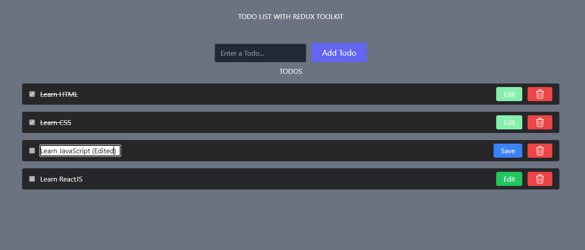

# React To-Do List

## Description
This is a simple to-do list application built with React.js. It allows users to add, delete, and manage their tasks efficiently. The app demonstrates React fundamentals like component structure, state management(Redux toolkit), and event handling.

## Features
- Add new tasks
- Mark tasks as completed
- Delete tasks
- Update tasks
- Responsive design

